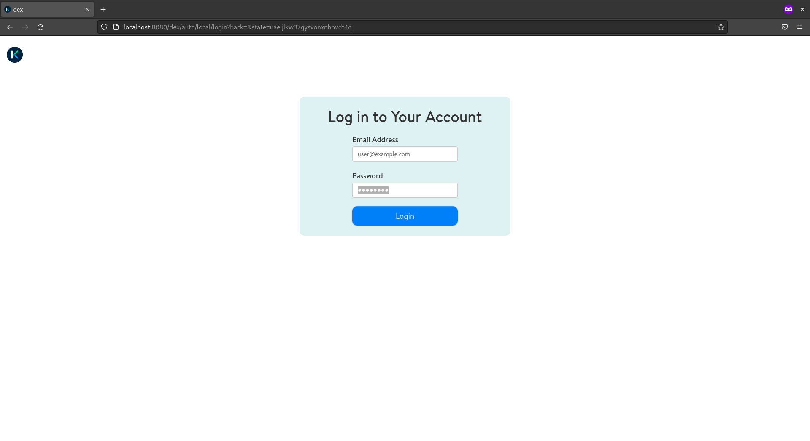

# Installation guide

To deploy `fl-studio` it is expected to have the following requirements fulfilled:

## TODO

* [ ] Update the [Start the FL-studio's federated learning training sample](#start-the-fl-studios-federated-learning-training-sample) screenshots to use the actual sample pipeline.
* [ ] Update documentation to use `fl-studio` instead of `katulu-fl`

## Requirements

* [Docker](https://docs.docker.com/engine/install/) locally installed
* A Kubernetes cluster (< `v1.21.x`) running, e.g [EKS](https://docs.aws.amazon.com/eks/latest/userguide/create-cluster.html), [GKE](https://cloud.google.com/kubernetes-engine/docs/deploy-app-cluster#create_cluster), [AKS](https://docs.microsoft.com/en-us/azure/aks/kubernetes-walkthrough#create-aks-cluster) or on-prem:
  > 📝 Kubernetes < `v1.21.x` is needed due to [`no matches for kind "CustomResourceDefinition error`](https://github.com/kubeflow/manifests/issues/2028)
* [kubectl installed](https://kubernetes.io/docs/tasks/tools/#kubectl) and [configured](https://kubernetes.io/docs/concepts/configuration/organize-cluster-access-kubeconfig/) to use the kubernetes cluster.
* [kustomize installed](https://kubectl.docs.kubernetes.io/installation/kustomize/).
* [kind](https://kind.sigs.k8s.io/docs/user/quick-start/#installation): Kind is used to emulate an edge kubernetes cluster where the fl-edge client will run.
* [curl](https://curl.se/download.html).
* [python3](https://www.python.org/downloads/): To fetch the latest release tag.

## Deploy fl-studio

> 📝 the following deployment is not meant for a full production environment, e.g ingress tls is not configured, default username and password are hardcoded, etc

### 1. Download the latest release assets:

```shell
LATEST_RELEASE_URL=$(curl -s -H "Accept: application/vnd.github.v3+json" https://api.github.com/repos/katulu-io/fl/releases/latest)
FL_SUITE_MANIFESTS_URL=$(echo $LATEST_RELEASE_URL | python -c 'import json,sys;print(json.load(sys.stdin)["assets"][0]["url"])')
# TODO: strip-components=1 and -C $SPECIFIC_DIR
mkdir -p release-manifests && curl -s -L -H "Accept: application/octet-stream" "$FL_SUITE_MANIFESTS_URL" | tar xzf - --strip-components=1 -C release-manifests
```

### 2. Configure FL-Studio to be exposed locally

Get the IP-Address where fl-studio is going to be exposed. In Linux this is done with:

> 📝 Change eth0 with the network interface you want to use

```shell
export LOCAL_IP_ADDRESS=$(ip addr show wlp0s20f3 | awk '/inet / {print $2}' | sed -r 's/(.*)\/.*/\1/')
```

In MacOS is:

```shell
echo "TODO"
```

Then set the kustomize parameters for fl-studio's components: spire-server, fl-orchestrator and container-registry.

```shell
cat <<EOF > ./release-manifests/kustomize/fl-studio/overlays/standalone/config/spire-server-params.env
spire_server_sni=spire.$LOCAL_IP_ADDRESS.sslip.io
EOF
cat <<EOF > ./release-manifests/kustomize/fl-studio/overlays/standalone/config/fl-orchestrator-params.env
fl_orchestrator_sni=fl-orchestrator.$LOCAL_IP_ADDRESS.sslip.io
EOF
cat <<EOF > ./release-manifests/kustomize/fl-studio/overlays/standalone/config/container-registry-params.env
container_registry_fqdn=registry.$LOCAL_IP_ADDRESS.sslip.io
EOF
cat <<EOF > ./release-manifests/kustomize/fl-studio/overlays/standalone/config/internal-registry-credentials.json
{
  "auths":{
    "registry.$LOCAL_IP_ADDRESS.sslip.io:8080": {
      "auth":"cmVnaXN0cnk6cmVnaXN0cnk="
    }
  }
}
EOF
```

### 3. Deploy the kustomize manifests

```shell
while ! kustomize build ./release-manifests/kustomize/fl-studio/overlays/standalone | kubectl apply -f -; do echo "Retrying to apply resources"; sleep 10; done
```

Wait for all the pods to be ready:

```shell
kubectl get pods -n cert-manager
kubectl get pods -n istio-system
kubectl get pods -n auth
kubectl get pods -n knative-eventing
kubectl get pods -n knative-serving
kubectl get pods -n kubeflow
kubectl get pods -n katulu-fl
kubectl get pods -n spire
kubectl get pods -n container-registry
```

### 4. Access the fl-suite

Once all pods are ready, you can access the fl-suite by port-forwarding Istio's Ingress-Gateway to `localhost` and the `$LOCAL_IP_ADDRESS`. For ease of use run this command in a separate terminal session. The access to fl-studio will be used throughout this guide:

```shell
kubectl port-forward svc/istio-ingressgateway --address localhost,$LOCAL_IP_ADDRESS -n istio-system 8080:80 8443:443
```

You can now open your browser and visit http://localhost:8080/. You should get the following login screen where you can login with the default email address: `user@example.com` and password: `12341234`.



<br />


<br />


## Start an edge client required by the federated learning training sample

To emulate an edge deployment we will use [kind](https://kind.sigs.k8s.io).

### 1. Download the fl-edge manifests:

```shell
LATEST_RELEASE_URL=$(curl -s -H "Accept: application/vnd.github.v3+json" https://api.github.com/repos/katulu-io/fl/releases/latest)
FL_EDGE_MANIFESTS_URL=$(echo $LATEST_RELEASE_URL | python -c 'import json,sys;print(json.load(sys.stdin)["assets"][1]["url"])')
curl -s -L -H "Accept: application/octet-stream" "$FL_EDGE_MANIFESTS_URL" | tar xzf -
```

The manifests will be located under `./workspace/example`

### 2. Download the federated learning training dataset

> 📝 **TODO** the exapected dataset directory path is `./workspace/example/dataset`


### 3. Create the kubernetes edge cluster

> 📝 It is expected that KUBECONFIG is configured to access the cluster used in the [Deploy fl-studio](Deploy fl-studio) steps.

```shell
cd ./workspace/example/
curl -s https://github.com/katulu-io/fl/example/init-edge.sh | bash
curl -s http://localhost:9000/init-edge.sh | bash
Entry ID         : b254ae23-bc60-4e7e-98af-963f71aebeff
SPIFFE ID        : spiffe://katulu.io/flower-client
Parent ID        : spiffe://katulu.io/hostname-local-edge
Revision         : 0
TTL              : default
Selector         : k8s:node-name:local-edge-control-plane
Selector         : k8s:ns:katulu-fl
Selector         : k8s:pod-label:app:flower-client

Entry ID         : de6a9efb-7c26-48c5-b1ea-216dc18c556f
SPIFFE ID        : spiffe://katulu.io/fl-operator
Parent ID        : spiffe://katulu.io/hostname-local-edge
Revision         : 0
TTL              : default
Selector         : k8s:node-name:local-edge-control-plane
Selector         : k8s:ns:katulu-fl
Selector         : k8s:pod-label:app:fl-operator-envoyproxy

Creating cluster "local-edge" ...
 ✓ Ensuring node image (kindest/node:v1.21.10) 🖼
 ✓ Preparing nodes 📦
 ✓ Writing configuration 📜
 ✓ Starting control-plane 🕹️
 ✓ Installing CNI 🔌
 ✓ Installing StorageClass 💾
Set kubectl context to "kind-local-edge"
You can now use your cluster with:

kubectl cluster-info --context kind-local-edge --kubeconfig local-edge-kubeconfig.yaml

Have a question, bug, or feature request? Let us know! https://kind.sigs.k8s.io/#community 🙂
```

Wait for the kubernetes' kind node is ready:

```shell
export KUBECONFIG=$(pwd)/local-edge-kubeconfig.yaml
kubernetes get nodes
NAME                       STATUS   ROLES                  AGE   VERSION
local-edge-control-plane   Ready    control-plane,master   11m   v1.21.10
```

### 4. Deploy the fl-edge

```shell
while ! kustomize build ./kustomize/fl-edge | kubectl apply -f -; do echo "Retrying to apply resources"; sleep 10; done
```

Wait for all the pods to be ready:

```shell
kubectl get pods -n spire
kubectl get pods -n fl-operator
kubectl get pods -n katulu-fl
```

Once all the pods are READY and assuming the steps from [Start the FL-studio's federated learning training sample](#Start the FL-studio's federated learning training sample) were done, the `fl-client` pod should start executing the fl-training:

```shell
kubectl -n katulu-fl logs -f -l app=flower-client -c flower-client
Downloading: "https://download.pytorch.org/models/resnet50-0676ba61.pth" to /root/.cache/torch/hub/checkpoints/resnet50-0676ba61.pth
100.0%
INFO flower 2022-04-25 14:25:18,109 | connection.py:102 | Opened insecure gRPC connection (no certificates were passed)
DEBUG flower 2022-04-25 14:25:18,110 | connection.py:39 | ChannelConnectivity.IDLE
DEBUG flower 2022-04-25 14:25:18,111 | connection.py:39 | ChannelConnectivity.CONNECTING
DEBUG flower 2022-04-25 14:25:18,112 | connection.py:39 | ChannelConnectivity.READY
```
