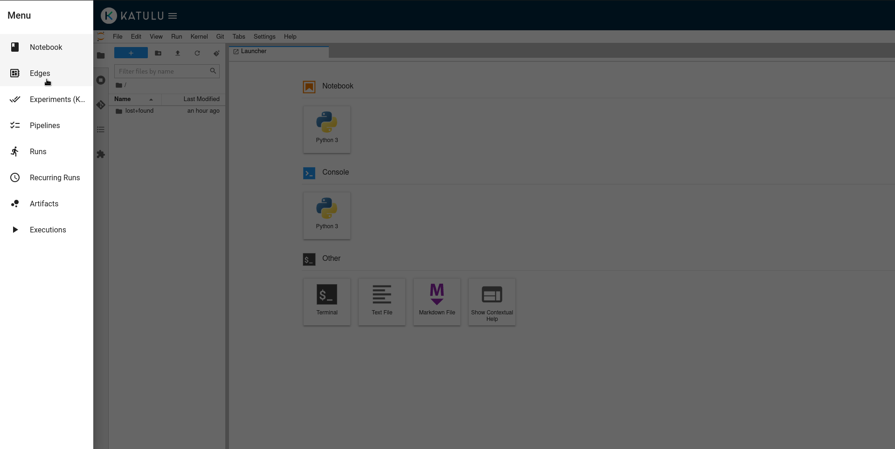
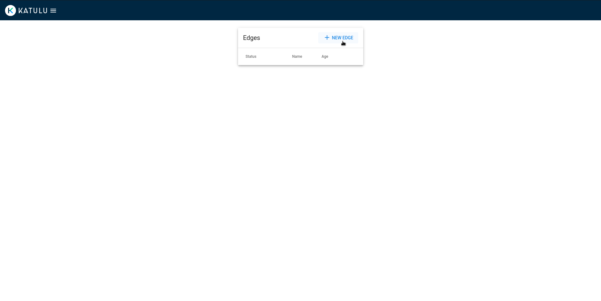
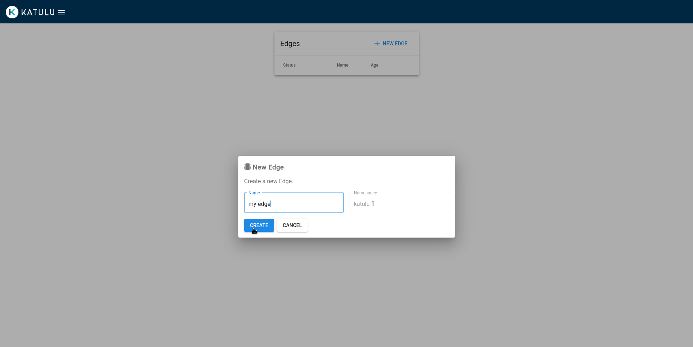
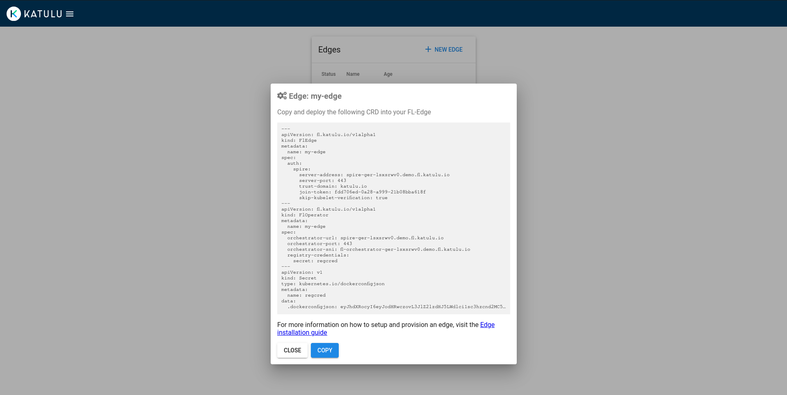

# Installation guide - Edge

To deploy a `fl-edge` it is expected to have the following requirements fulfilled:

## Requirements

* An instance of the fl-suite running.
* A Kubernetes cluster (< `v1.21.x`) running, e.g [EKS](https://docs.aws.amazon.com/eks/latest/userguide/create-cluster.html), [GKE](https://cloud.google.com/kubernetes-engine/docs/deploy-app-cluster#create_cluster), [AKS](https://docs.microsoft.com/en-us/azure/aks/kubernetes-walkthrough#create-aks-cluster) or on-prem:
  > 📝 Kubernetes < `v1.21.x` is needed due to [`no matches for kind "CustomResourceDefinition error`](https://github.com/kubeflow/manifests/issues/2028)
* [kubectl installed](https://kubernetes.io/docs/tasks/tools/#kubectl) and [configured](https://kubernetes.io/docs/concepts/configuration/organize-cluster-access-kubeconfig/) to use the kubernetes cluster.
* [kustomize installed](https://kubectl.docs.kubernetes.io/installation/kustomize/).
* [curl](https://curl.se/download.html).
* [python3](https://www.python.org/downloads/): To fetch the latest release tag.
* The [fl-suite repository](https://github.com/katulu-io/fl-suite) cloned and current working directory in `/path/to/cloned/fl-suite/docs`

## Deploy a fl-edge

### 1. Download the fl-edge manifests:

```shell
LATEST_RELEASE_URL=$(curl -s "https://api.github.com/repos/katulu-io/fl-suite/releases/latest")
FL_EDGE_MANIFESTS_URL=$(echo $LATEST_RELEASE_URL | python3 -c 'import json,sys;print(json.load(sys.stdin)["assets"][0]["url"])')
mkdir -p release-manifests/fl-edge && curl -s -L -H "Accept: application/octet-stream" "$FL_EDGE_MANIFESTS_URL" | tar xzf - --strip-components=1 -C release-manifests/fl-edge
```

### 2. Install the fl-edge manifests

```shell
while ! kustomize build example/fl-edge | kubectl apply -f -; do echo "Retrying to apply resources"; sleep 10; done
```

Wait for all the pods to be ready:

```shell
kubectl get pods -n fl-operator-system
```

### 3. Create a new edge-identity

Go to the running instance of the fl-suite and create a new edge:


<br />


<br />


<br />

### 4. Deploy the edge-identity resources

Copy the resources from the new edge by pressing the *Copy* button:


<br />

Apply the resources into the fl-edge kubernetes cluster:

```shell
kubectl apply -f - <<EOF
(paste resources here)
EOF
fledge.fl.katulu.io/my-edge created
floperator.fl.katulu.io/my-edge created
secret/regcred created
```

Wait for the edge pods to be ready:

```shell
kubectl get pods -n my-edge-spire-agent
kubectl get pods
```

After this the edge is ready to start processing federated learning jobs!. For a quick example check the [quickstart documentation](quickstart.md).
