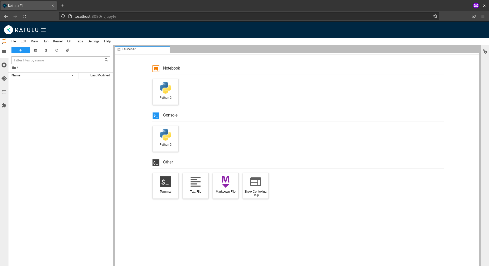

# Installation guide

To deploy `fl-suite` it is expected to have the following requirements fulfilled:

## Requirements

* [Docker](https://docs.docker.com/engine/install/) locally installed
* A Kubernetes cluster (< `v1.21.x`) running, e.g [EKS](https://docs.aws.amazon.com/eks/latest/userguide/create-cluster.html), [GKE](https://cloud.google.com/kubernetes-engine/docs/deploy-app-cluster#create_cluster), [AKS](https://docs.microsoft.com/en-us/azure/aks/kubernetes-walkthrough#create-aks-cluster) or on-prem:
  > 📝 Kubernetes < `v1.21.x` is needed due to [`no matches for kind "CustomResourceDefinition error`](https://github.com/kubeflow/manifests/issues/2028)
* [kubectl installed](https://kubernetes.io/docs/tasks/tools/#kubectl) and [configured](https://kubernetes.io/docs/concepts/configuration/organize-cluster-access-kubeconfig/) to use the kubernetes cluster.
* [kustomize installed](https://kubectl.docs.kubernetes.io/installation/kustomize/).
* [kind](https://kind.sigs.k8s.io/docs/user/quick-start/#installation): Kind is used to emulate an edge kubernetes cluster where the fl-edge client will run.
* [curl](https://curl.se/download.html).
* [python3](https://www.python.org/downloads/): To fetch the latest release tag.
* The [fl-suite](https://github.com/katulu-io/fl-suite) cloned and current working directory in `/path/to/cloned/fl-suite/docs`

## Deploy fl-suite

> 🥀 the following deployment is meant for a local test not a full production environment, due to configurations like missing ingress tls, hardcoded username and password, etc. That's why the steps will port-forward from kubectl instead of expose the ingress to the public-internet.

### 1. Download the latest release manifests:

```shell
LATEST_RELEASE_URL=$(curl -s "https://api.github.com/repos/katulu-io/fl-suite/releases/latest")
FL_SUITE_MANIFESTS_URL=$(echo $LATEST_RELEASE_URL | python3 -c 'import json,sys;print(json.load(sys.stdin)["assets"][1]["url"])')
mkdir -p release-manifests/fl-suite && curl -s -L -H "Accept: application/octet-stream" "$FL_SUITE_MANIFESTS_URL" | tar xzf - --strip-components=1 -C release-manifests/fl-suite
```

### 2. Configure the fl-suite to be exposed locally

Get the IP-Address where fl-suite is going to be exposed. In Linux this is done with:

> 🌻 Change eth0 with the network interface you want to use

```shell
export LOCAL_IP_ADDRESS=$(ip addr show eth0 | awk '/inet / {print $2}' | sed -r 's/(.*)\/.*/\1/')
```

In MacOS is:

```shell
export LOCAL_IP_ADDRESS=$(ifconfig eth0 | awk '/inet / {print $2}')
```

Then set the kustomize parameters for fl-suite's components: spire-server, fl-orchestrator and container-registry.

```shell
cat <<EOF > ./example/fl-suite/config/spire-server-params.env
spire_server_sni=spire.$LOCAL_IP_ADDRESS.sslip.io
EOF
cat <<EOF > ./example/fl-suite/config/fl-orchestrator-params.env
fl_orchestrator_sni=fl-orchestrator.$LOCAL_IP_ADDRESS.sslip.io
EOF
cat <<EOF > ./example/fl-suite/config/container-registry-params.env
container_registry_fqdn=registry.$LOCAL_IP_ADDRESS.sslip.io
EOF
cat <<EOF > ./example/fl-suite/config/internal-registry-credentials.json
{
  "auths":{
    "registry.$LOCAL_IP_ADDRESS.sslip.io:8080": {
      "auth":"cmVnaXN0cnk6cmVnaXN0cnk="
    }
  }
}
EOF
```

### 3. Deploy the kustomize manifests

```shell
while ! kustomize build example/fl-suite/ | kubectl apply -f -; do echo "Retrying to apply resources"; sleep 10; done
```

Wait for all the pods to be ready:

```shell
kubectl get pods -n cert-manager
kubectl get pods -n istio-system
kubectl get pods -n auth
kubectl get pods -n knative-eventing
kubectl get pods -n knative-serving
kubectl get pods -n kubeflow
kubectl get pods -n katulu-fl
kubectl get pods -n spire
kubectl get pods -n container-registry
```

### 4. Access the fl-suite

Once all pods are ready, you can access the fl-suite by port-forwarding Istio's Ingress-Gateway to `localhost` and the `$LOCAL_IP_ADDRESS`. For ease of use run this command in a separate terminal session.

```shell
kubectl port-forward svc/istio-ingressgateway --address localhost,$LOCAL_IP_ADDRESS -n istio-system 8080:80 8443:443
```

You can now open your browser and visit http://localhost:8080/. You should get the following login screen where you can login with the default email address: `user@example.com` and password: `12341234`.


<br />



<br />
