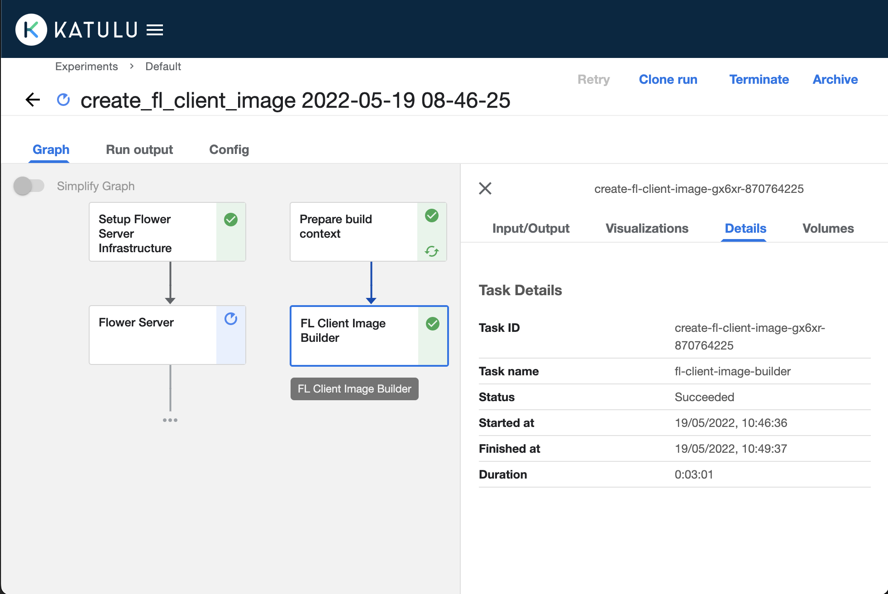

# Quickstart to Federated Learning with FL Suite

Let's run Federated Learning on Katulu's FL Suite!

To do that, we need to describe how a Federated Learning client will train and test a model. FL Suite then distributes this code among all connected clients, starts a Federated Learning server and instructs the clients to connect to this server, using this code during training.

At least two edge clients need to be connected to FL Suite before running these steps, as documented in the [installation guide](./installation-guide.md).

## Preparing and running the pipeline

Following up from the [installation guide](./installation-guide.md) a fl-suite jupyter notebook will be accessible at: http://localhost:8080. The next steps will use such notebook to start an FL pipeline.

We start by importing the necessary package:

```python
from fl_suite import pipelines
```

The `fl_suite.pipelines` package provides functions to describe Federated Learning clients and to build and run Federated Learning pipelines. A pipeline contains all the steps that need to be done on the server for Federated Learning. This includes cluster preparation for authentication, preparing the Federated Learning client code for distribution to the clients, and starting a Federated Learning server.

Let's create a simple Federated Learning client that loads the MNIST dataset and trains a simple model. The `pipelines.fl_client` decorator indicates that this is the Federated Learning client code.

```python
@pipelines.fl_client(packages=["tensorflow", "flwr==1.0.0"])
def mnist_client():
    import flwr as fl
    import tensorflow as tf

    (x_train, y_train), (x_test, y_test) = tf.keras.datasets.mnist.load_data()

    model = tf.keras.models.Sequential([
        tf.keras.layers.Flatten(input_shape=(28, 28)),
        tf.keras.layers.Dense(128, activation="relu"),
        tf.keras.layers.Dense(10),
    ])
    model.compile("adam", "sparse_categorical_crossentropy", metrics=["accuracy"])

    class MNISTClient(fl.client.NumPyClient):
        def get_parameters(self, config):
            return model.get_weights()

        def fit(self, parameters, config):
            model.set_weights(parameters)
            model.fit(x_train, y_train, epochs=1, batch_size=32)
            return model.get_weights(), len(x_train), {}

        def evaluate(self, parameters, config):
            model.set_weights(parameters)
            loss, accuracy = model.evaluate(x_test, y_test)
            return loss, len(x_test), {"accuracy": accuracy}

    fl.client.start_numpy_client(server_address="localhost:9080", client=MNISTClient())
```

FL Suite uses [Flower](https://flower.dev) as its mechanism for Federated Learning, therefore, we start a Flower client as part of this code. More information about Flower clients can be found in [its quickstart documentation](https://flower.dev/docs/quickstart-tensorflow.html), which this code closely follows. The Flower client connects to a specific URL `localhost:9080`. This is a special proxy that each client uses. FL Suite automatically resolves this URL to connect to the Flower server started by a pipeline using this client code.

With this code wrapped by the `pipelines.fl_client` decorator, we can now run Federated Learning from a single function:

```python
training_pipeline = pipeline.training_pipeline(mnist_client)
pipelines.run(training_pipeline)
```

This function creates a new pipeline which prepares and distributes the client as wrapped by `pipelines.fl_client`, starts a Flower server and signals each connected client to start training.


