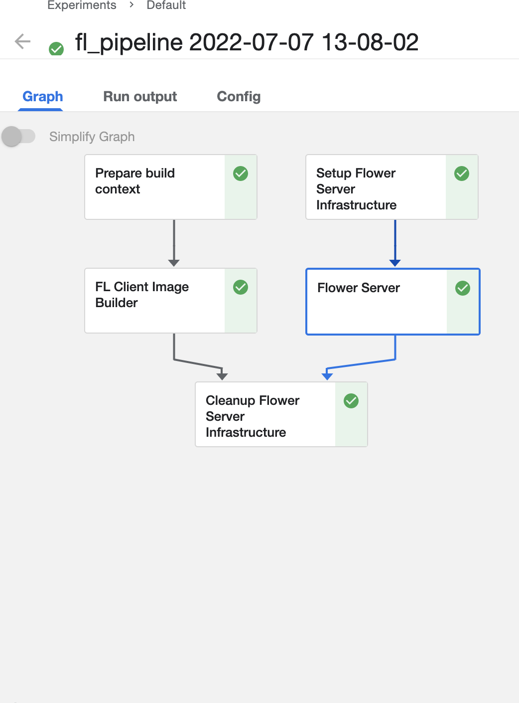

# Summary 

This example provides an industrial use case of FL Suite for federated predictive maintenance. We assume you have already read and completed FL Suite's [quickstart](https://github.com/katulu-io/fl-suite/blob/beta/docs/quickstart.md).

## Brief on tool-wear predictions 

[Katulu](http://katulu.io) provides expertise and products in industrial AI; one of them is [custom tool-wear predictions across all machine tools](http://katulu.io/en/solutions/machine-tools/) within condition monitoring and predictive maintenance solutions. The challenge faced in the tool-wear use case is building models that can reliably predict the degradation of the machine tools and forecasting their Remaining Useful Life (RUL). 

## Tool-wear dataset suitable for federated learning

A federated model for custom tool-wear solutions should perform for multiple tool types and workpiece materials. Building robust models requires a good benchmark dataset with the multi-material tool and workpiece combinations. We prepare and merge two public milling datasets for easy use in federated machine learning tasks to fulfil this purpose. The dataset and associated 
documentations  located in Katulu's [Uniwear dataset](https://github.com/katulu-io/uniwear-dataset) 
repository.

## A federated nonlinear regression model 

* We provide an example use case for the FL suite in predictive maintenance leveraging the uniwear dataset.  
* The model won't perform as Katulu's state-of-the-art models. We present the example as a realistic use case.
* The model uses acquired mechanical signals directly without further feature extraction. One would need to extract meaningful features from the measured sensory signals.
* Feature scaling applied only locally in clients for simplicity. We need FL Suite's federated analytics in computing global feature scaling as a preprocessing step.
* Here, the time-series use case turned into a regression problem. This procedure would result in a significant loss of serial information. More advanced modelling requires state-of-the-art temporal deep learning models.
* Our clients fetch the entire uniwear dataset and use a single signal as a subset. Each mechanical signal would be available to clients in separate streams in an actual deployment. 

## Running the uniwear pipeline 

The following statement imports the core package. 

```python
from fl_suite import pipelines
```

This package builds a federated learning pipeline. Preparing authentications to the compute cluster, client codes for distributing to clients, building compute nodes and starting the federated learning server. 
 
Let's create a uniwear federated learning client. The client defines the model, loads the uniwear dataset from the repository address, shuffles the rows for regression, prepares test and training set, applies feature scaling, trains a nonlinear regression model, and reports Mean Absolute Percent Error (MAPE) performance per client. 

```python
@pipelines.fl_client(packages=["tensorflow", "flwr", "pandas", "scikit-learn"])
def uniwear_client():
    """ Participating tool wear clients will use different experiments."""
    import flwr as fl
    import tensorflow as tf
    import pandas as pd
    import sklearn
    import numpy as np
    from sklearn.model_selection import train_test_split
    from sklearn.preprocessing import MinMaxScaler
    from sklearn.metrics import mean_absolute_percentage_error

    """ Raw-features : Direct sensor data."""
    feature_names = ['force_z', 'vibration_x', 'vibration_y']
    label = ['tool_wear']
    nfeatures = len(feature_names)

    """ Nonlinear regression model."""
    model = tf.keras.models.Sequential(
    [
        tf.keras.layers.Input(nfeatures),
        tf.keras.layers.Dense(nfeatures * 2, activation="relu"),
        tf.keras.layers.Dense(nfeatures * 2, activation="relu"),
        tf.keras.layers.Dense(1),
    ]
    )
    model.compile("adam", "mape", metrics=["mape"])

    """ Client data mapping. """
    experiment_maping = {
                         '0':'c1', '1':'c4', '2':'c6', 
                         '3':'W1', '4':'W2', '5':'W3', 
                         '6':'W4', '7':'W5', '8':'W6',
                         '9':'W7','10':'W8', '11':'W9'
                        } 
    subset_id = str(np.random.randint(0, 11))

    """ Uniwear Katulu's public dataset : Pull from the repo https://github.com/katulu-io/uniwear-dataset """
    uniwear_url = 'https://raw.githubusercontent.com/katulu-io/uniwear-dataset/main/data/uniwear.csv'
    df_uniwear = pd.read_csv(uniwear_url)

    """ Different experimental data is selected from uniwear dataset randomly."""
    experiment_tag = experiment_maping[subset_id]
    df_client = df_uniwear[df_uniwear['experiment_tag'] == experiment_tag].copy()

    """ Shuffle experiment data for regression."""
    df = df_client.sample(frac=1.0, random_state=4242)

    """ Split for test/train and scale locally. """
    X = df[feature_names]
    y = df['tool_wear']
    x_train0, x_test0, y_train, y_test = train_test_split(
    X, y.to_numpy(), test_size=0.33)
    scaler = MinMaxScaler()
    scaler.fit(x_train0)
    x_train = scaler.transform(x_train0)
    x_test = scaler.transform(x_test0)

    """ Prepare Flower client class."""
    class UniWearClient(fl.client.NumPyClient):

        def get_parameters(self):
            return model.get_weights()

        def fit(self, parameters, config):
            model.set_weights(parameters)
            model.fit(x_train, y_train, epochs=5, verbose=0)
            return model.get_weights(), len(x_train), {}

        def evaluate(self, parameters, config):
            model.set_weights(parameters)
            loss, mape = model.evaluate(x_test, y_test, verbose=2)
            return loss, len(x_val), {"accuracy": mape}

    fl.client.start_numpy_client("localhost:9080", client=UniWearClient())

```

Now, we can trigger the federated learning pipeline.

```python
pipelines.run(uniwear_client, 
              registry='localhost:5000',
              verify_registry_tls=False)
```

A resulting pipeline screenshot. 


